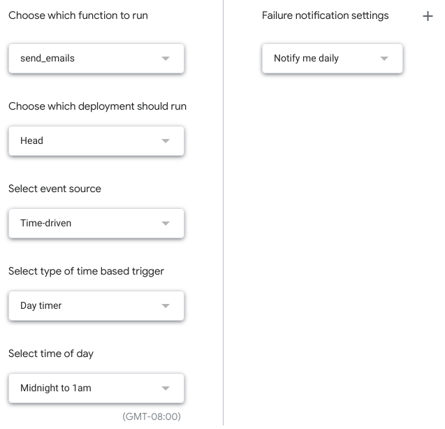

# Send email from Google Sheets

This is the code that powers the department's email from Google sheets.

## 'Installation'

- Get edit access to the spreadsheet of feedback results
- Go to Tools → Script editor
- Paste in the Code.gs file from this repository
- Save
- In the top bar, select `send_emails` as the main function
- Click Run, and agree to the permissions
- Go to Edit → Current project's triggers
  - If there aren't triggers in place, create one to run the `send_emails` function (see screenshot below)

#### Trigger configuration

